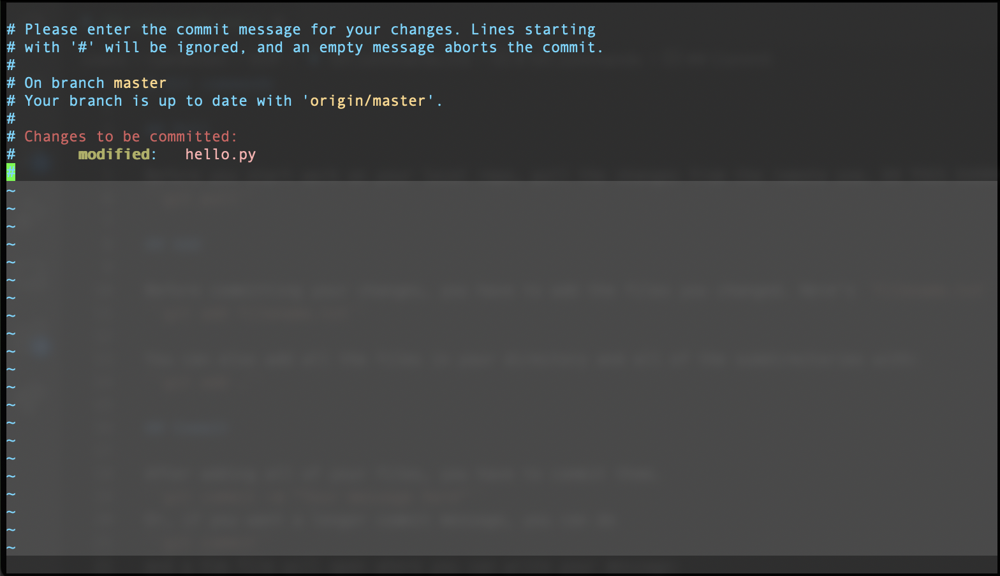

# Git commands

## Pull

Before you start work on your local repo, pull the changes from the remote one. DO THIS EVERY TIME.

``git pull``

## Add

Before committing your changes, you have to add the files you changed. Here's `filename.txt` as an example:

``git add filename.txt``

You can also add all the files in your directory and all of the subdirectories with:

``git add .``

## Commit

After adding all of your files, you have to commit them.

``git commit -m "Your message here"``

Or, if you want a longer commit message, you can do 

``git commit``

and a Vim file will open where you can write your message:



## Push
After committing, you will have to push your changes to the remote repository.

``git push origin master``

## Branching

Sometimes, you will not want to change the master branch and you will want your own branch to make changes to. You can create a branch via

``git branch your-branch-name``

You can switch between branches via `checkout`:

``git checkout``

### Pushing Branch

You aren't in the master branch, so instead of `git push origin master`, do

``git push origin <branch-name>``

### Merging

To merge your branch with the master branch, `checkout` to the master branch, and then use `git merge`:

```
git checkout master
git merge <branch-name>
```