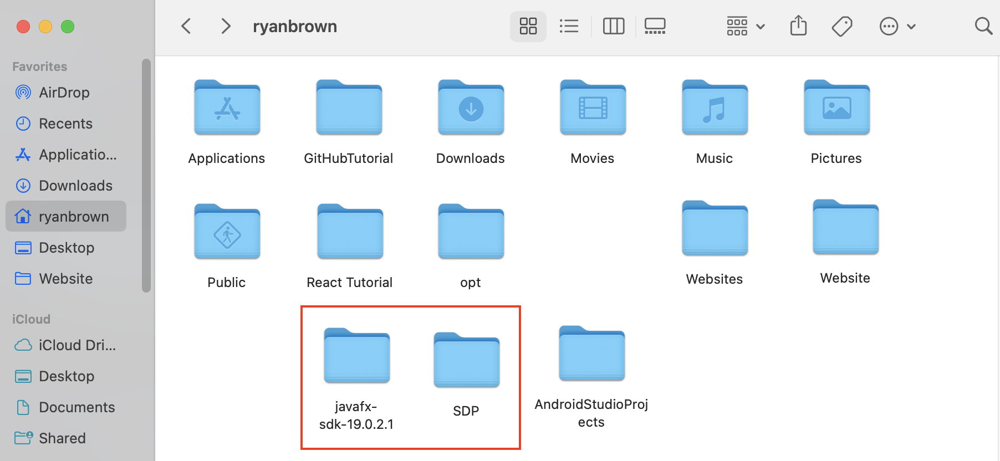

# Steps to take before running the application for the first time

## Download the JavaFX SDK

Download the JavaFX SDK [here](https://gluonhq.com/products/javafx/). Move the `javafx-sdk-19.0.2.1` folder as needed so that it is in the same directory as the `SDP` folder (not inside of it).



## Dependencies

You will then have to specify where your library files are. In ``settings.json``, add the file path to your `javafx-sdk-19.0.2.1/lib` folder from root.

```json
{
    "java.project.sourcePaths": ["src"],
    "java.project.outputPath": "bin",
    "java.project.referencedLibraries": [
        "/Users/ryanbrown/javafx-sdk-19.0.2.1/lib/*.jar",
        // add JavaFX file path here
    ],
}
```

# Getting Started

Welcome to the VS Code Java world. Here is a guideline to help you get started to write Java code in Visual Studio Code.

## Folder Structure

The workspace contains two folders by default, where:

- `src`: the folder to maintain sources
- `lib`: the folder to maintain dependencies

Meanwhile, the compiled output files will be generated in the `bin` folder by default.

> If you want to customize the folder structure, open `.vscode/settings.json` and update the related settings there.

## Dependency Management

The `JAVA PROJECTS` view allows you to manage your dependencies. More details can be found [here](https://github.com/microsoft/vscode-java-dependency#manage-dependencies).