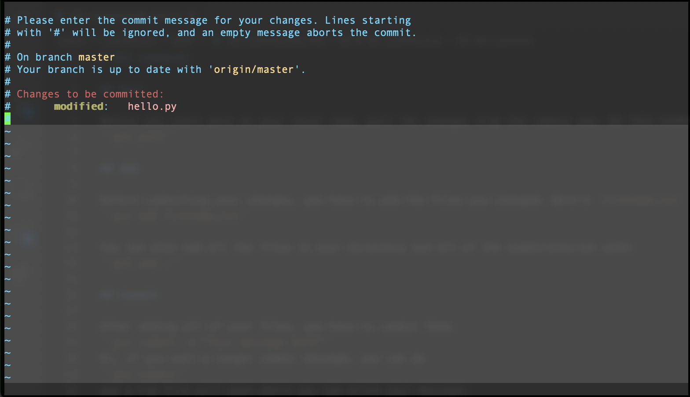

# Git commands

## Pull

Before you start work on your local repo, pull the changes from the remote one. DO THIS EVERY TIME.

The command is ``git pull``.

```
ryanbrown@Ryans-MacBook-Air Example % git pull
remote: Enumerating objects: 4, done.
remote: Counting objects: 100% (4/4), done.
remote: Compressing objects: 100% (3/3), done.
remote: Total 3 (delta 0), reused 0 (delta 0), pack-reused 0
Unpacking objects: 100% (3/3), 775 bytes | 258.00 KiB/s, done.
From https://github.com/Person1507/Example
   dea2cac..4ea7800  master     -> origin/master
Updating dea2cac..4ea7800
Fast-forward
 hello.java | 5 +++++
 1 file changed, 5 insertions(+)
 create mode 100644 hello.java
```

## Add

Before committing your changes, you have to add the files you changed. Here's `filename.txt` as an example:

``git add filename.txt``

You can also add all the files in your directory and all of the subdirectories with:

``git add .``

## Commit

After adding all of your files, you have to commit them using `git commit`.

``git commit -m "Your message here"``

Example:

```
ryanbrown@Ryans-MacBook-Air Example % git commit -m "Add test file"
[master dea2cac] Add test file
 1 file changed, 1 insertion(+)
 create mode 100644 hello.py
```

Or, if you want a longer commit message, you can do 

``git commit``

and a Vim file will open where you can write your message:



## Push
After committing, you will have to push your changes to the remote repository.

``git push origin master``

Example:

```
ryanbrown@Ryans-MacBook-Air Example % git push origin master
Enumerating objects: 4, done.
Counting objects: 100% (4/4), done.
Delta compression using up to 8 threads
Compressing objects: 100% (2/2), done.
Writing objects: 100% (3/3), 301 bytes | 301.00 KiB/s, done.
Total 3 (delta 0), reused 0 (delta 0), pack-reused 0
To https://github.com/Person1507/Example.git
   bfeddf1..dea2cac  master -> master
```

## Branching

Sometimes, you will not want to change the master branch and you will want your own branch to make changes to. You can create a branch via

``git branch <branch-name>``

Example:

```
ryanbrown@Ryans-MacBook-Air Example % git branch ryan
ryanbrown@Ryans-MacBook-Air Example % git branch
* master
  ryan
```

You can switch between branches via `checkout`:

``git checkout``

Example:

```
ryanbrown@Ryans-MacBook-Air Example % git checkout ryan
Switched to branch 'ryan'
ryanbrown@Ryans-MacBook-Air Example % git branch
  master
* ryan
```

You use the same commands that you would use for adding files and committing.

### Pushing Branch

You aren't in the master branch, so instead of `git push origin master`, do

``git push origin <branch-name>``

Example:

```
ryanbrown@Ryans-MacBook-Air Example % git push origin ryan
Total 0 (delta 0), reused 0 (delta 0), pack-reused 0
remote: 
remote: Create a pull request for 'ryan' on GitHub by visiting:
remote:      https://github.com/Person1507/Example/pull/new/ryan
remote: 
To https://github.com/Person1507/Example.git
 * [new branch]      ryan -> ryan
```

### Merging

To merge your branch with the master branch, `checkout` to the master branch, and then use `git merge`:

```
git checkout master
git merge <branch-name>
```

```
ryanbrown@Ryans-MacBook-Air Example % git checkout master
Switched to branch 'master'
Your branch is up to date with 'origin/master'.
ryanbrown@Ryans-MacBook-Air Example % git merge ryan
Updating 6acbef4..5735dfc
Fast-forward
 hello.py | 1 +
 1 file changed, 1 insertion(+)
 ```